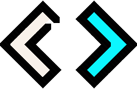

# FreeCodeCamp - Projects
Repositório dedicado a armazenar os projetos referentes aos cursos do FreeCodeCamp

  <h2>How to contact me:</h2>

## Responsive Web Design Certification
### Projeto 1: Build a Tribute page

- Tribute Page para o [Bob Marley](https://github.com/soaresmilton/freeCodeCamp/tree/main/ResponsiveWebDesignCertification/TributePage)

- Veja o projeto [Tribute Page - Bob Marley no Code Pen](https://codepen.io/soaresmiltinho/full/KKNXOwm)

### Projeto 2: Build a Survey Form
- Abstract Survey Form: [Survey Form](https://github.com/soaresmilton/freeCodeCamp/tree/main/ResponsiveWebDesignCertification/SurveyForm)
 
- Veja o projeto [Survey Form no Code Pen](https://codepen.io/soaresmiltinho/full/BaQJeYd)

### Projeto 3: Build a Product Landing Page

- Gostei tanto desse projeto teste que fiz o deploy dele através do GitHub Pages. Confira ➡ [Clicando Aqui](https://soaresmilton.github.io/ProductLandingPage/)

- Confira o projeto no [Code Pen](https://codepen.io/soaresmiltinho/pen/RwoQPaW) 

- Acesso o Código no GitHub [Clique aqui](https://github.com/soaresmilton/freeCodeCamp/tree/main/ResponsiveWebDesignCertification/ProductLandingPage)
### Projeto 4: Build a Techinical Documentation Page

Criei uma página de documentação do JavaScript.

- Acesse o repositório no [Code Pen](https://codepen.io/soaresmiltinho/pen/bGBvJeZ)
- Acesse pelo GitHub [Clique Aqui](https://github.com/soaresmilton/freeCodeCamp/tree/main/ResponsiveWebDesignCertification/TechinicalDocumentationPage)

### Projeto 5: Build a Personal Portfolio Webpage

 EM CONTRUÇÃO

## Footer - Dedicatória

Trabalhos desenvolvidos para obtenção do certificado do curso Responsive Web Design Certification, promovido pelo [freeCodeCamp](https://www.freecodecamp.org/).

Todos os projetos foram desenvolvidos com muito ❤ por [Milton Soares](https://www.linkedin.com/in/soaresmilton/). 