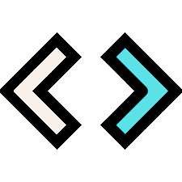

  

  <h2>How to contact me:</h2>

# Objetivo:

Esse projeto foi desenvolvido como requisito parcial para obtenção do certificado do curso [Responsive Web Design](https://www.freecodecamp.org)
disponibilizado gratuitamente pelo Free Code Camp.

# Tecnologias:

Neste trabalho foi utilizado somente HTML e CSS puros!
O intuito desse projeto é finalizar os requisitos destacados pelo curso.

# Desenvolvimento:

A proposta era criar uma landing page de algum produto. Optei por fazer algo genérico, e acabou que o produto escolhido foram as placas de vídeo modelos RTX da Geforce.

Além de criar a página, me preocupei em criar uma "identidade visual", portanto, criei a logo, que por sinal ficou muito clean.

A ideia era criar a ideia que a loja fictícia "General Shop" tivesse criado um anúncio especificamente para aumentar as vendas de suas placas de vídeos. 

# Resultado do projeto:

Confira o resultado deste projeto aqui: [Landing Page](https://soaresmilton.github.io/ProductLandingPage/)

Se quiser, confira este projeto pelo Code Pen: [Acesse aqui](https://codepen.io/soaresmiltinho/details/RwoQPaW)

# Contribua com o projeto:

1. Faça um fork do projeto;

2. Crie uma branch para fazer suas modificações (`git checkout -b my-new-resource`);

3. Faça o commit (`git commit -am 'Adding a new resource...'`)

4. Faça o push (`git push origin my-new-resource`)

5. Envie um Pull Request

# Licença
Esse projeto está sob a licença MIT. Veja o arquivo [LICENSE](LICENSCE.MD) para mais informções.

Projeto desenvolvido por <a href="https://www.linkedin.com/in/soaresmilton/"><strong>Milton Soares</strong> 
 </a>

